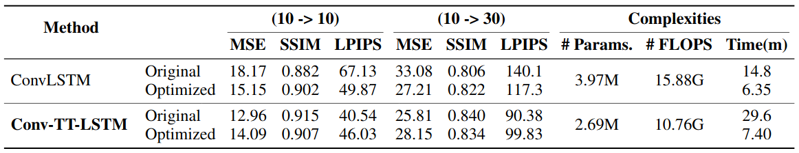
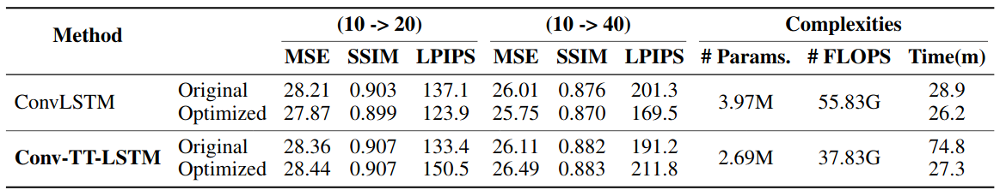

# Convolutional Tensor-Train LSTM (Conv-TT-LSTM)

## Intro
PyTorch implementations of the paper, '***Convolutional Tensor-Train LSTM for Spatio-Temporal Learning***', NeurIPS 2020. [[project page](https://sites.google.com/nvidia.com/conv-tt-lstm)]

- **code/ (original)**: The original implementation of the paper. 
- **code_opt/ (optimized)**: The optimized implementation to accelerate training.
    - The details of optimization tricks are presented at ECCV 2020 tutorial, '*Mixed Precision Training for Convolutional Tensor-Train LSTM*' [[slides]](https://nvlabs.github.io/eccv2020-mixed-precision-tutorial/files/wonmin_byeon-mixed-precision-training-for-convolutional-tensor-train-lstm.pdf) [[video]](https://www.youtube.com/watch?v=1XuD-ozHTLY&feature=youtu.be)

## License 
Copyright (c) 2020 NVIDIA Corporation. All rights reserved. This work is licensed under a NVIDIA Open Source Non-commercial license.

## Dataset
- Moving-MNIST-2
- KTH action

## Evaluation of multi-steps prediction
Higher PSNR/SSIM and lower MSE/LPIPS values indicate better predictive results. \# of FLOPs denotes the multiplications for one-step prediction per sample, and Time(m) represents the clock time (in minutes) required by training the model for one epoch (10,000 samples)

- Moving-MNIST-2 dataset

- KTH action dataset

## Contacts
This code was written by [Wonmin Byeon](https://github.com/wonmin-byeon) \(wbyeon@nvidia.com\) and [Jiahao Su](https://github.com/jiahaosu) \(jiahaosu@terpmail.umd.edu\).
